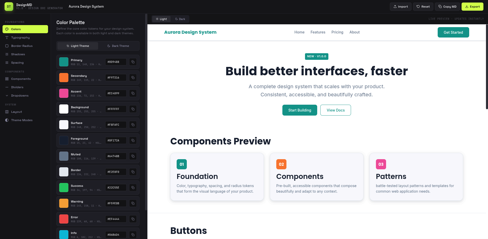

# DesignMD

A visual tool for creating and exporting design system documentation in Markdown. Built with vanilla HTML, CSS, and JavaScript — no build tools required.

[Preview](https://me-imdadul.github.io/DesignMD/)



---
description as (Pre)
## Features

- **Markdown Documentation** — Generate comprehensive `design.md` docs with color tables, type scales, component specs, and more
- **Color Palette** — Define colors with light/dark theme support, real-time hex/RGB/HSL preview
- **Typography** — Google Fonts integration, heading scale, font weights, line height, letter spacing
- **Border Radius** — Visual scale from xs to full (pill) with live preview cards
- **Shadow System** — Multi-layer shadows with configurable offset, blur, spread, and opacity
- **Spacing System** — Token-based spacing scale with visual bar representation
- **Component Styles** — Customize buttons, inputs, cards, dialogs, badges, chips, alerts, navbar, and sidebar
- **Dividers** — Thickness, color, style (solid/dashed/dotted), and spacing
- **Dropdowns** — Fully configurable dropdown with options editor
- **Layout System** — Container width, grid columns, gutter, and responsive breakpoints
- **Theme Modes** — Independent light and dark color tokens
- **Live Preview** — Instant visual feedback in a realistic UI mockup
- **Multiple Exports** — Markdown, JSON, CSS variables, Tailwind config, design tokens JSON
- **Import/Reset** — Import saved config or reset to defaults
- **Local Storage** — Auto-saves all changes in browser

---

## Getting Started

No build step needed. Open the file directly in a browser:

```bash
open index.html
# or
xdg-open index.html
# or just double-click index.html in your file manager
```

All data is persisted in `localStorage` — your work is saved automatically.

---

## Usage

1. **Navigate** — Use the sidebar to switch between sections: Colors, Typography, Border Radius, Shadows, Spacing, Components, Dividers, Dropdowns, Layout, Theme Modes
2. **Edit** — Adjust sliders, pick colors, select fonts, and toggle light/dark theme tabs
3. **Preview** — The right panel renders a live UI mockup reflecting all your token values. Toggle between light and dark preview
4. **Export** — Click the Export button (or Copy MD for quick Markdown) to download your design tokens in various formats
5. **Import** — Use the Import button to load a previously saved `.json` or `.md` config
6. **Project Info** — Edit project name, author, version, and description under Theme Modes

---

## Export Formats

| Format | File | Description |
|--------|------|-------------|
| Markdown | `design.md` | Human-readable design documentation |
| JSON | `configuration.json` | Full state export for re-import |
| CSS | `tokens.css` | CSS custom properties (light + dark) |
| Tailwind | `tailwind.config.js` | Tailwind CSS theme extension |
| Design Tokens | `tokens.tokens.json` | Design tokens JSON format |

---

## Project Structure

```
.
├── index.html          # Single-page application (HTML + CSS + JS)
├── public/             # Static assets (empty)
└── README.md           # This file
```

Everything lives in a single `index.html` file — the app is self-contained with no dependencies. The primary output is `design.md`, a ready-to-use design system documentation file.

---

## Contributing

Contributions are welcome! Here's how to get involved:

### Reporting Issues

Open an issue describing the bug or feature request. Include:
- A clear title and description
- Steps to reproduce (for bugs)
- Expected vs actual behavior
- Screenshots if applicable

### Submitting Changes

1. Fork the repository
2. Create a feature branch:
   ```bash
   git checkout -b feat/your-feature-name
   ```
3. Make your changes in `index.html`
4. Test that the app opens correctly in a browser and all existing functionality works
5. Commit with a descriptive message:
   ```bash
   git commit -m "feat: add support for custom font loading"
   ```
6. Push to your fork and open a Pull Request

---

## License

MIT
